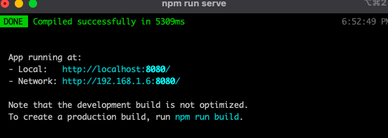
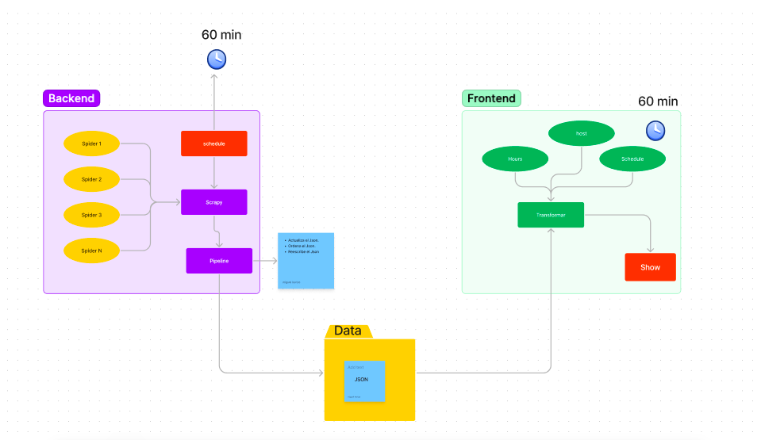

# NewTime

## Start Vue
1. Clone the project.
2. ```python3 schedule.py``` to run the spiders.
3. In other console
4. ```cd NewTime```
5. ```npm install```
6. ```npm run serve```
7. Ready to use el Vue

## Vuejs:
http://localhost:8080/



## Structure:
